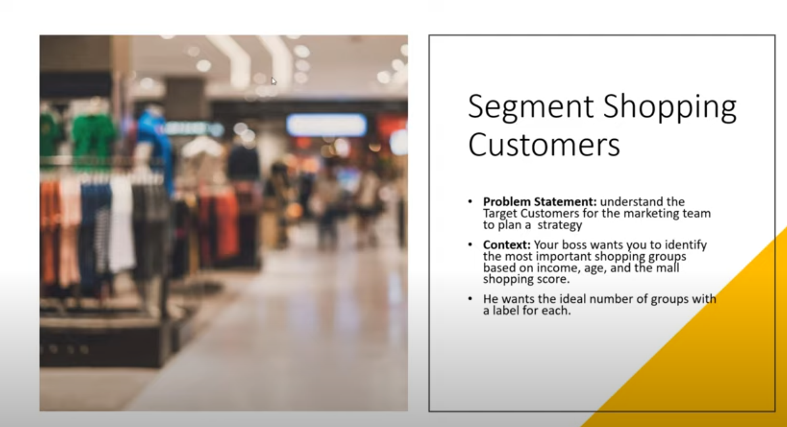
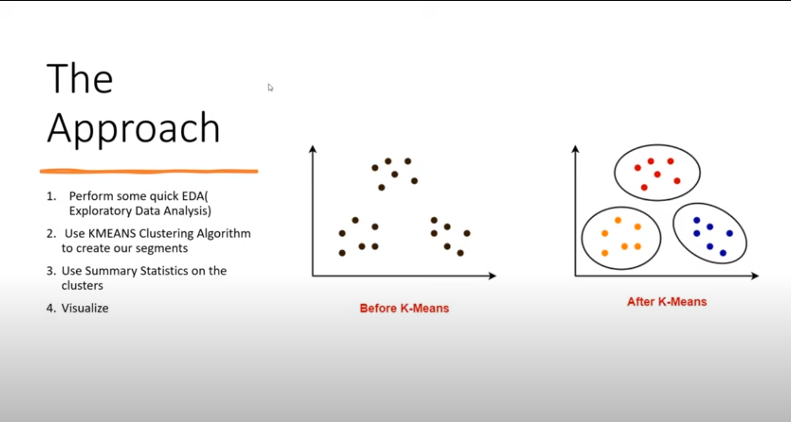
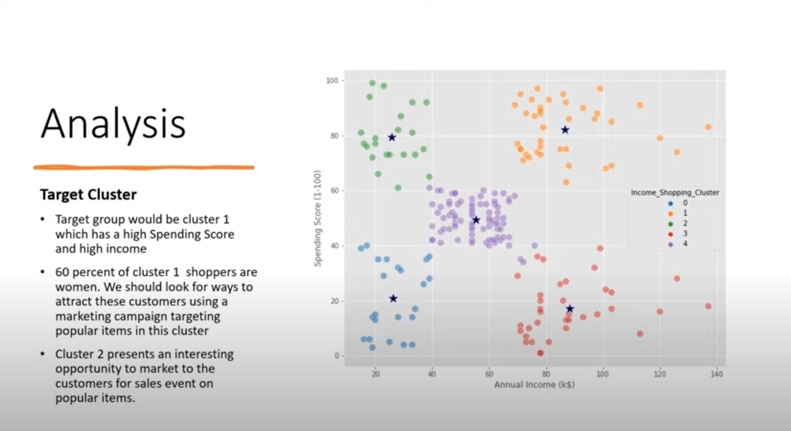

# 🛍️ Segment Shopping Customers

Welcome to the **Shopping Customer Segmentation** project!  
Ever wondered how to target the right customers for better sales? Let's solve that! 🎯

## 🚨 The Problem  
Marketing teams struggle to identify their ideal customers. Without proper segmentation, ads target the wrong audience, leading to wasted budget and lost sales. 😓  

📌 **Problem Statement:**  
  

## 🔍 My Approach  
I used **data-driven segmentation** to group customers based on **income, age, and shopping habits**. The goal? To find the **best customer groups** and help businesses target them effectively.  

📌 **Pipeline & Strategy:**  
  

## 🎉 The Final Results  
Success! Now the client has:  
✅ More sales 💰  
✅ Increased revenue 📈  
✅ Better marketing strategy 🎯  
✅ Happy customers 😊  

📌 **End Results:**  
  

---

## 🚀 Ready to boost your sales?  
It's time to **solve your problem** and make more money! 💸  
Give it a shot and drop me a message:  
📩 **abdullahyonus616@gmail.com**  

Let's make your business thrive! 🚀🔥  
